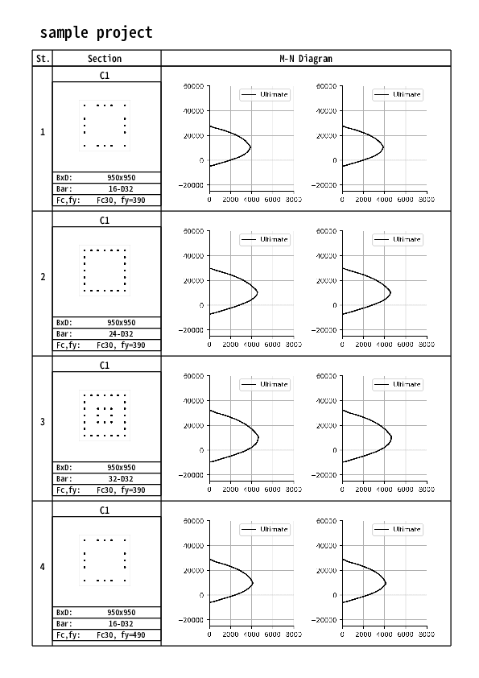

# renpy

- Reinforced concrete capacity package
- based on ACI Code.
- Genrate MN-diagram for reinforced concrete columns
  - Deep Learnin Test
- Calculate bending moment capacity for the column

---

# Table of content

- [Souse Code](#souse-code)
- [1. MnGen.py](#1-mngenpy)
  - [1.1 Use example](#11-use-example)
  - [1.2 __init__](#12-init)
  - [1.3 read_cntl()](#13-read_cntl)
  - [1.4 read_column()](#14-read_column)
  - [1.5 solve()](#15-solve)
  - [1.6 input excel data](#16-input-excel-data)
- [2. col.py](#2-colpy)
  - [2.1 Use example](#21-use-example)
- [3. deep learning](#3-deep-learning)

---

# Souse Code

| script    | Description                 | import           |
|:----------|-----------------------------|------------------|
| mnGen.py  | Mn-Diagram generator        | col.py,report.py |
| col.py    | column capacity calculation | rc.py            |
| rc.py     | -                           | -                |
| report.py | make pdf report             | -                |

# 1. MnGen.py




| class | Description        |
|:------|--------------------|
| MnGen | Mn Curve Generator |

| method      | Description                                                | Use Module        |
|:------------|------------------------------------------------------------|-------------------|
| __init__    | initialize of variable                                     |                   |
| read_cntl   | read CNTL table in excel data & make variable              |                   |
| read_column | read COLUMN table in excel data & make variable            |                   |
| solve       | solve mn capacity, save result data using column module    | col.py            |
| solve_deep  | make mn capacity for the deep learning, and make datasets  | col.py            |
| make_report | under develop m(_ _)m                                      | report.py         |
| read_calc   | read CALC table, generate mn curve figure, make pdf report | col.py, report.py |

## 1.1 Use example

``` python
input_path = "./test/data.xlsx"
obj = MnGen(input_path) # make object
obj.read_cntl()         # read cntl table data
obj.read_column()       # read column table data
obj.solve()             # solve and save mn curve data
obj.read_calc()         # read calc table data & make pdf data
## or
# obj.solve_deep()      # solve and save datasets for the DL
```

## 1.2 init
__init__(input_path)

| variable | Description                         |
|:---------|-------------------------------------|
| inp_path | path to the input data (Excel data) |
| home_dir | directly to the inp_path            |

## 1.3 read_cntl()

| variable     | Description                              | Remark       |
|:-------------|------------------------------------------|--------------|
| out_path     | output data path                         |              |
| view_path    | directly path to the inp_path            |              |
| report_path  | directly path to the pdf output file     |              |
| report_title | title in output report                   |              |
|              |                                          |              |
| ndiv         | incremental of the neutral axis          | 0.05d - 2.0d |
| mdmax        | maximum bending moment in mn curve graph |              |
| ndmin        | minimum axial force in mn curve graph    |              |
| ndmax        | maximum axial force in mn curve graph    |              |

## 1.4 read_column()

| varibale      | Description                   |
|:--------------|-------------------------------|
| st            | story                         |
| symb          | column symbol                 |
| fc            | compressive concrete strength |
| fy            | steel bar strength            |
| b             | column width                  |
| d             | column depth                  |
| dia           | bar diameter                  |
| nx,ny,dtx,dty | see input data specification  |
| name          | story column symbol           |

## 1.5 solve()

| varibale | Description                       |
|:---------|-----------------------------------|
| obj      | column object using column module |

## 1.6 Input Excel Data

pls, check the input/data.xlsx

### CNTL
| output        | ndiv       | mdmax | ndmin  | ndmax |
|:--------------|------------|-------|--------|-------|
| ./result.xlsx | 10         | 8000  | -25000 | 80000 |
| ./images      |            |       |        |       |
| ./sample.pdf  | Pj. Sample |       |        |       |


### COLUMN
| variable   | description                     | unit  |
|:-----------|---------------------------------|-------|
| st         | story.                          | -     |
| sym.       | column symbol                   | -     |
| fc         | compressive concrete strength   | N/mm2 |
| fy         | yield strength of the steel bar | N/mm2 |
| b,d        | column dimension                | mm    |
| dia        | dia. of the steel bar           | mm    |
| nx1,ny1,.. | num of the main bar             | nos   |
| dtx,dty,.. | distance from the column face   | mm    |

### CALC
| variable              | description                 | unit |
|:----------------------|-----------------------------|------|
| st                    | story. num                  | -    |
| sym.                  | column symbol               | -    |
| xnum                  | load num. in X-dir.         | int  |
| ynum                  | load num. in Y-dir          | int  |
| load_x1, load_y1, ... | title                       | str  |
| N_x1, N_y1, ..        | axial load in x, y dir.     | kN   |
| M_x1, M_y1, ..        | bending moment in x, y dir. | kN.m |

---

# 2. col.py

## 2.1 How to use

``` python
>import col
```
| class  | Description                        |
|:-------|------------------------------------|
| col    | Calculation of the column capacity |
| Aft_mn | plot mn-curve graph                |


## 2.2 col.col()

``` python
>obj = col.col(fc,fy,b,dd,nx,ny,dtx,dty,dia)
```

| method                                                   | Description                                      |
|:---------------------------------------------------------|--------------------------------------------------|
| init(fc,fy,b,dd,nx,ny,dtx,dty,dia,lfc,sfc,lfy,sfy,alpha) | initialize of variable                           |
| feature()                                                | get sIx, sIy, sZx, sZy, Ag                       |
| bar_pos(nx,ny,dtx,dty)                                   | set steel bar position                           |
| narc(b,dd,xn,fc,ft,pos,area)                             | xn/neutral axis -> Na/Permissible axial force    |
| marc(b,dd,xn,fc,ft,pos,area,nn)                          | xn/neutral axis -> Ma/Permissible bending moment |
| mnarc(b,dd,fc,ft,pos,aw,nn)                              | nn/axial force -> Ma/Permissible bending moment  |
| ma(direction,fc,ft,nn)                                   | nn/axial force & direction(X or Y) -> Ma         |
| mnaGen(direction,fc,ft,div)                              | direction(X or Y) -> generate mn data            |
| nca_c()                                                  | permissible compressive axial force strength     |
| nu_t()                                                   | permissible tension axial force strength         |
| mnuaci(direction,nd)                                     |                                                  |
| mnuaci_twoM(direction,nd)                                |                                                  |
| mn_result_xlsx(div,path,sheet_name,wb)                   |                                                  |
| make_model_fig(name)                                     |                                                  |
| make_fig(input_file,name)                                |                                                  |
| aft_mn(direction,div,path)                               |                                                  |
| mnuGen(direction,div)                                    |                                                  |
| sig2(ee,sigy,e)                                          | e/strain -> stress of the steel bar              |
| nuaci(xn,fc,eu,k1,k2,k3,ee,sigy,b,dd,pos,area)           |                                                  |
| muaci(xn,fc,eu,k1,k2,k3,ee,sigy,b,dd,pos,area,nn)        |                                                  |

### init()
| Parameters | Description                                           | unit  |       |
|:-----------|-------------------------------------------------------|-------|-------|
| fc         | compressive concrete strength                         | N/mm2 | float |
| fy         | yield steel bar strength                              | N/mm2 | float |
| b          | width of the column                                   | mm    | float |
| dd         | depth of the column                                   | mm    | float |
| nx,ny      | number of steel bar                                   | Nos   | int   |
| dtx,dty    | position of the steel bar from column surface         | mm    | float |
| lfc,sfc    | long & short term permissble concrete strength        | N/mm2 | float |
| lfy,sfy    | long & short term permissble tensile strength         | N/mm2 | float |
| alpha      | multipler of the yield strength for ultimate capacity | -     | float |


## 2.3 col.Aft_mn()

``` python
>obj = col.Aft_mn(div,path,sheet_name)
```

| method   | Description                  | variable  |
|:---------|------------------------------|-----------|
| init     |                              | see below |
| spec     | return input data from excel |           |
| make_fig | make mn-diaglam png data     | see below |

### init
| variable   | Description                  | unit           |
|:-----------|------------------------------|----------------|
| input_file | path to the excel input data | -              |
| name       |                              | str            |
| direction  | direction                    | "X", "Y", "XY" |
| mdmax      | max. bending moment          | kN.m           |
| ndmin      | min. axial force             | kN             |
| ndmax      | max. axial force             | kN             |

### make_fig
| variable      | Description | unit      |
|:--------------|-------------|-----------|
| xtitle,ytitle | title       | str       |
| xnum,nux,mux  | X-Dir.      | -,kN,kN.m |
| ynmy,nuy,muy  | Y-Dir.      | -,kN,kN.m |

---

# 3. Deep Learning

---


# 4. beam.py

