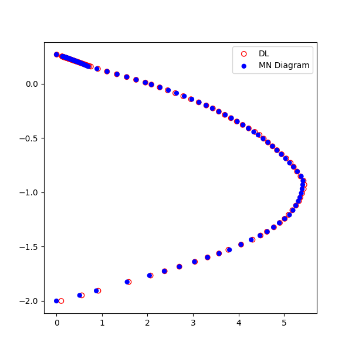
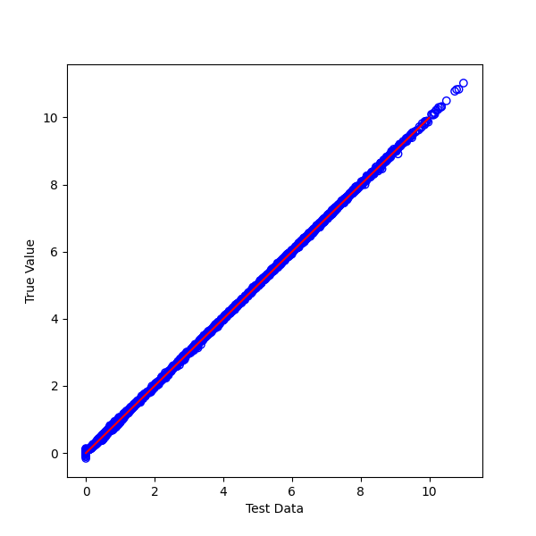

# DL for MN
- Deep Learning based on the mn-diagram
- use feature as Zx, Zy, Ag

## scripts

| script   | Description                  |
|:---------|------------------------------|
| mn_dl.py | deep learning for mn data    |
| load.py  | load & use dl model by above |

## Model

``` python
Model: "sequential"
_________________________________________________________________
Layer (type)                 Output Shape              Param #   
=================================================================
dense (Dense)                (None, 100)               900       
_________________________________________________________________
dense_1 (Dense)              (None, 100)               10100     
_________________________________________________________________
dense_2 (Dense)              (None, 32)                3232      
_________________________________________________________________
dense_3 (Dense)              (None, 1)                 33        
=================================================================
Total params: 14,265
Trainable params: 14,265
Non-trainable params: 0
```

## Result






